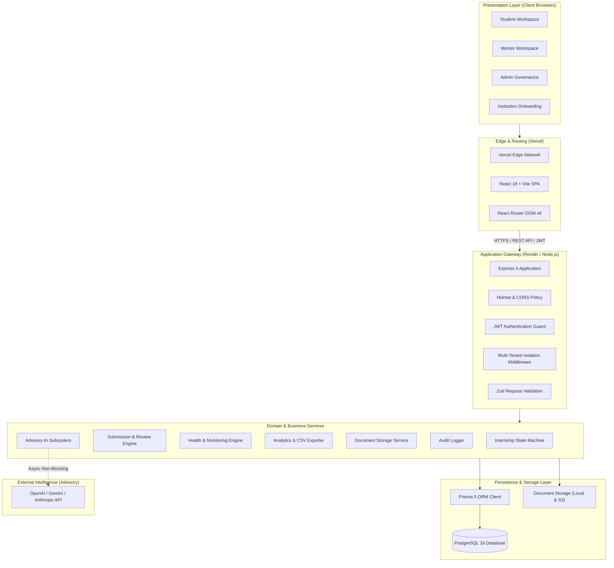
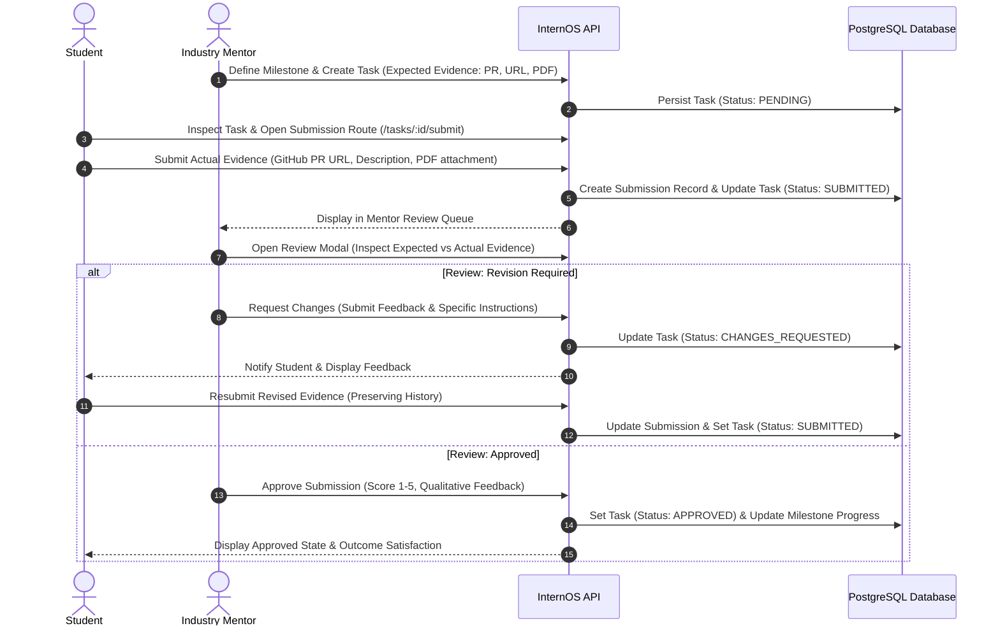
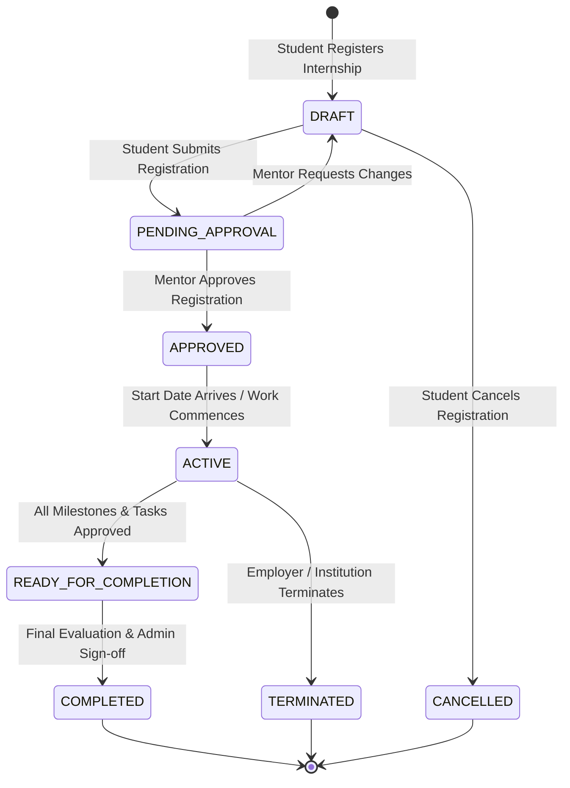
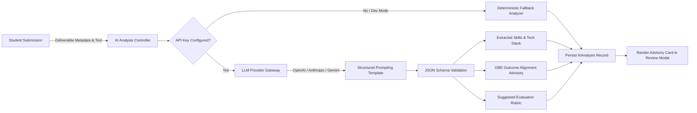
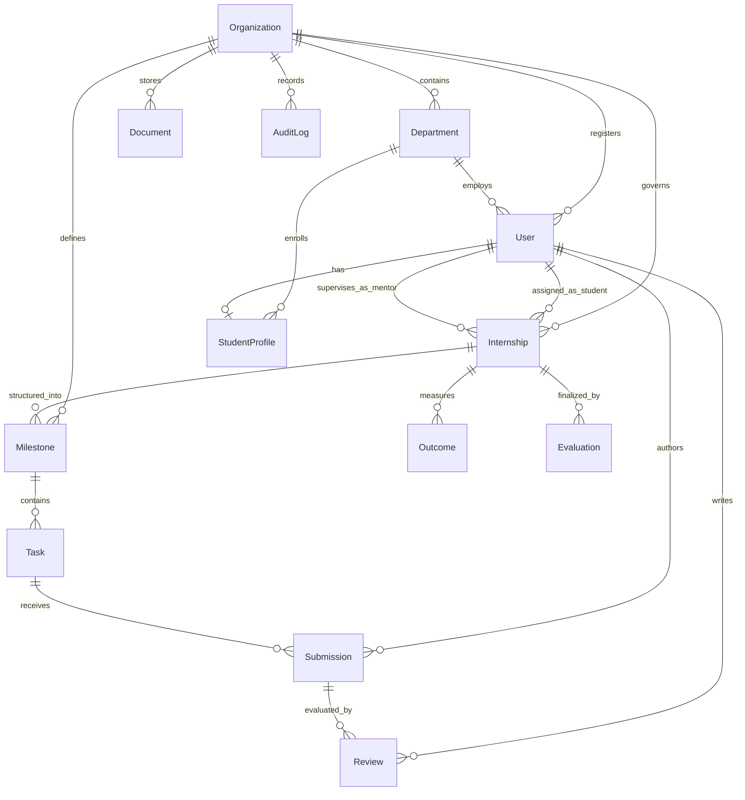

<p align="center">
  <br />
  
  <br />
  <br />
</p>

<h1 align="center">InternOS</h1>

<p align="center">
  <strong>Enterprise Multi-Tenant Internship Governance, Monitoring & Outcome-Based Education (OBE) Operating System</strong>
</p>

<p align="center">
  Engineered for universities, host employers, and students with zero-leakage tenant isolation, deterministic progress tracking, verifiable evidence review loops, and accredited learning outcome attainment.
</p>

<p align="center">
  <a href="https://internos-web-tau.vercel.app"><strong>🌐 Launch Live Application</strong></a> •
  <a href="https://internos-api-gntk.onrender.com/api/v1/health"><strong>⚡ API Health Check</strong></a> •
  <a href="https://internos-web-tau.vercel.app/register-institution"><strong>🏫 Register Institution</strong></a>
</p>

<p align="center">
  <a href="https://www.typescriptlang.org/"></a>
  <a href="https://nodejs.org/"></a>
  <a href="https://react.dev/"></a>
  <a href="https://vitejs.dev/"></a>
  <a href="https://expressjs.com/"></a>
  <a href="https://www.postgresql.org/"></a>
  <a href="https://www.prisma.io/"></a>
  <a href="https://tailwindcss.com/"></a>
  <a href="https://vercel.com/"></a>
  <a href="https://render.com/"></a>
</p>

<br />

<div align="center">

| 🔒 Multi-Tenancy | ⚡ SLA Response | 🧪 Test Suite | 🎯 OBE Alignment |
| :---: | :---: | :---: | :---: |
| **Strict Server-Side Isolation**<br>`organizationId` JWT Enforced | **< 170ms P95 Latency**<br>`153 kB` Gzip SPA Bundle | **278 / 278 Tests Passed**<br>68 Suites (100% Green) | **ABET / NBA / NAAC**<br>Verifiable Evidence Criteria |

</div>

<br />

---

## 📑 Table of Contents

- [🚀 Overview](#-overview)
- [🎯 Problem Statement](#-problem-statement)
- [💡 Proposed Solution](#-proposed-solution)
- [👥 Target Users](#-target-users)
- [✨ Key Features](#-key-features)
- [🏗️ System Architecture](#️-system-architecture)
- [🔄 System Workflows](#-system-workflows)
- [🧠 AI / ML Architecture](#-ai--ml-architecture)
- [🛠️ Technology Stack](#️-technology-stack)
- [📁 Project Structure](#-project-structure)
- [🗄️ Database Architecture](#️-database-architecture)
- [🔐 Authentication & RBAC](#-authentication--rbac)
- [🛡️ Security Implementation](#️-security-implementation)
- [🔌 API Documentation](#-api-documentation)
- [🔑 Environment Variables](#-environment-variables)
- [⚙️ Installation & Setup](#️-installation--setup)
- [▶️ Running Locally](#️-running-locally)
- [🧪 Testing & QA](#-testing--qa)
- [🎥 Live Production Demo](#-live-production-demo)
- [🚀 Cloud Deployment](#-cloud-deployment)
- [🐳 Docker Deployment](#-docker-deployment)
- [📊 Current Project Status](#-current-project-status)
- [🗺️ Product Roadmap](#️-product-roadmap)
- [⚠️ Limitations & 🔮 Future Scope](#️-limitations--future-scope)
- [🤝 Contributing & License](#-contributing--license)

---

## 🚀 Overview

**InternOS** is a production-grade, multi-tenant internship governance and academic monitoring operating system built to govern the university-to-industry internship lifecycle. Academic institutions and corporate hosts routinely struggle with fragmented communication, unverified student progress, subjective grading, and the absence of alignment with Outcome-Based Education (OBE) standards.

InternOS resolves this structural deficit through a clean, domain-driven architecture organized around three distinct workspaces:

1. **Student Workspace**: Centered on personal internship execution — moving sequentially from **Milestones** (developmental phases) to **Tasks** (actionable assignments), **Submissions** (delivered work), **Evidence** (GitHub pull requests, live deployments, test reports, and PDF documentation), **Feedback** (mentor review loops), and **Learning Outcomes** (demonstrated competencies).
2. **Mentor Workspace**: Built for industry supervisors to supervise active interns, approve internship registrations, organize milestone phases, assign tasks with expected evidence criteria, review student deliverables through structured accept/revision feedback loops, and evaluate learning outcome attainment.
3. **Admin Workspace**: Built for institutional governance, tenant onboarding, department configuration, user invitations with secure activation tokens, CSV bulk student import, workflow blueprint design, immutable audit logging, and organization-wide analytics with CSV export.

---

## 🎯 Problem Statement

Higher-education institutions, engineering colleges, vocational academies, and corporate host employers face systemic hurdles when coordinating student off-campus internships:

```
❌ The Status Quo (Broken & Disjointed)
Spreadsheets & WhatsApp → Disconnected Mentors → Zero OBE Evidence → Unverified Sign-offs
```

* **Fragmented Communication & Data Chaos**: Tracking is scattered across unversioned spreadsheets, disjointed email threads, unorganized chat groups, and lost physical paperwork.
* **Absence of Real-Time Monitoring**: Academic advisors and company managers frequently discover student stagnation, absenteeism, or mentor disconnects weeks after they occur, putting academic credits and company projects at risk.
* **Lack of Outcome-Based Education (OBE) Alignment**: Accreditation bodies require measurable proof that internships satisfy specific Program Outcomes (POs) and Course Outcomes (COs). Conventional tools treat internships merely as attendance checklists rather than competency-building curricula.
* **Subjective Evaluation & Missing Review Loops**: Work deliverables are rarely evaluated against concrete rubrics, and students lack a standardized mechanism to revise deliverables based on mentor feedback.
* **Multi-Institution Governance Gaps**: University consortiums and multi-campus systems require centralized software deployment without leaking student records, company agreements, or evaluation dossiers across institutional boundaries.
* **Premature & Unverified Completions**: Students often obtain completion sign-offs without formal employer verification, missing mandatory milestone deliverables, or lacking verifiable evidence.

---

## 💡 Proposed Solution

InternOS structures internship management into a deterministic, verifiable, and student-centric operating workflow:

```
🏢 Institution / Tenant (Strictly Isolated Root)
  ├── 🏫 Academic Departments
  ├── 👨‍🏫 Industry Mentors
  └── 🎓 Student
        ↓
      📋 Internship Registration (Approved with PDF Offer Letter)
        ↓
      🚩 Structural Milestones (Phase 1, Phase 2, Phase 3)
        ↓
      ⚡ Actionable Tasks (JWT Auth, Schema Design, CI/CD)
        ↓
      📦 Student Deliverables (GitHub PR, Live URL, PDF Docs)
        ↓
      🔍 Mentor Evaluation (Approved or Revision Required)
        ↓
      🎯 OBE Competencies (Program Outcomes Satisfied)
        ↓
      🏆 4-Gate Academic Completion Dossier
```

### Core Solution Highlights
* **Strict Multi-Tenant Foundation**: Every transaction, database record, and file upload is strictly bounded by the tenant's `Organization` ID derived from authenticated JWT claims.
* **Clear Role Separation**: Workspace navigation dynamically adapts to the authenticated role (`STUDENT`, `MENTOR`, `ADMIN`). No arbitrary perspective switchers in production.
* **Context-Preserving Evidence Submission**: Clicking "Submit Evidence" on a task opens the submission form directly for that specific task (`/app/student/tasks/:taskId/submit`), preserving task, milestone, and internship context.
* **Iterative Evidence & Revision Loop**: Mentors can accept evidence (automatically completing the task and recalculating progress) or request revisions with required feedback. Students can resubmit evidence under the same task without losing review history.
* **Real PDF Streaming & Vault**: Uploaded offer letters and documents are validated via MIME and magic-byte checks (`%PDF-`) and streamed with inline or attachment headers.
* **Deterministic Health & Attention Engine**: A 100% code-based scoring engine calculates `ON_TRACK`, `ATTENTION`, or `CRITICAL` statuses from overdue tasks, inactive days, and open concerns — avoiding unpredictable AI hallucinations.
* **4-Prerequisite Completion Gate**: Guarantees an internship cannot reach `COMPLETED` unless:
  1. All required milestone tasks are completed.
  2. All required submissions have accepted mentor reviews.
  3. Program outcomes / learning outcomes are satisfied.
  4. The mentor has submitted a structured final evaluation.

---

## 👥 Target Users

| Role | System Identifier | Primary Purpose | Key Capabilities |
| :--- | :--- | :--- | :--- |
| **Administrator** | `ADMIN` / `INSTITUTION_ADMIN` | Institutional governance & tenant configuration | Register institutions, configure departments, invite students and mentors with secure activation tokens, CSV bulk student import, workflow blueprint design, audit log inspection, institutional analytics with CSV export. |
| **Student** | `STUDENT` | Academic internship execution & evidence submission | Register academic internships, upload PDF offer letters, inspect assigned milestones and tasks, submit multi-type evidence (GitHub PRs, URLs, PDFs), view mentor feedback, resubmit revised evidence, track OBE learning outcomes. |
| **Industry Mentor** | `MENTOR` / `INDUSTRY_MENTOR` | Technical supervision & competency evaluation | Review pending internship registrations (`Approve` / `Request Changes`), supervise assigned interns, define milestone phases, assign tasks with expected evidence criteria, evaluate student submissions (Accept / Request Revision), submit final evaluations. |
| **Faculty Supervisor** *(Arch. Support)* | `FACULTY` / `FACULTY_SUPERVISOR` | Academic cohort oversight | Cohort timeline monitoring, academic advisory check-ins, and institutional compliance reviews. |
| **Head of Department** *(Arch. Support)* | `HOD` | Departmental leadership | Departmental performance review and faculty allocation oversight. |

> [!NOTE]
> The active core platform has been streamlined around the primary trio: **Admin**, **Student**, and **Mentor**. Extended roles (`FACULTY`, `HOD`) remain supported in the relational schema and permission engine for institutions requiring traditional multi-tier faculty sign-offs.

---

## ✨ Key Features

### 🔐 1. Authentication & Multi-Tenant Security
- **Stateless JWT Security**: HMAC-SHA256 tokens carrying user identity, active role, and organization scope.
- **Tenant Isolation Middleware**: Automatically validates organization context and query parameters, guaranteeing zero cross-tenant leakage.
- **Secure Account Activation**: Invitation tokens hashed with bcrypt; user sets credentials upon activation.
- **Role-Based Routing**: Authenticated role strictly determines whether the user accesses the Student, Mentor, or Admin workspace.

### 🎓 2. Student Workspace
- **Academic Internship Registration**: Multi-field registration flow capturing title, company details, dates, track, industry mentor info, and PDF offer letter upload.
- **Interactive PDF Offer Letter Viewer**: Dedicated streaming endpoint with inline rendering and attachment downloads.
- **Milestone & Task Exploration**: Hierarchical breakdown of developmental stages with progress indicators and actionable tasks.
- **Context-Preserving Evidence Submission**: Dedicated `/app/student/tasks/:taskId/submit` route with support for GitHub PRs, repositories, live URLs, file uploads, and explanatory notes.
- **Feedback & Resubmission Ledger**: View mentor comments, scores, and revision notes with direct resubmission capability.
- **Outcome-Based Education (OBE) Tracking**: Real-time alignment of actual student evidence against mentor-defined expected criteria for Program Outcomes (e.g., `PO-1`, `PO-2`).

### 👨‍🏫 3. Mentor Workspace
- **Operational Overview**: Daily attention feed highlighting pending submissions, active interns, and tasks requiring review.
- **Scoped Intern Management**: "My Interns" view strictly filtered to interns assigned to the authenticated mentor.
- **Registration Intake**: Review incoming student registrations with full inspection of company data, dates, and uploaded offer letter PDFs (`Approve` or `Request Changes`).
- **Milestone & Task Authoring**: Structure internships into developmental phases and assign actionable tasks with explicit expected evidence requirements.
- **Submission Review Queue**: Review student actual evidence against expected criteria, assign 1–5 star scores, provide feedback, and select `APPROVED` or `REVISION_REQUIRED`.
- **Final Evaluation & Completion**: Structured rubric evaluation tied to specific student-internship pairs.

### 🏛️ 4. Institutional Administration & Governance
- **Real Institution Onboarding**: Self-service institution registration at `/register-institution` creating isolated tenant roots and primary admin accounts.
- **Department Registry**: Manage departments with live operational metrics (students, mentors, active internships, completion rates) without legacy HOD bottlenecks.
- **User Provisioning & Invitations**: Issue invitations for `STUDENT` and `MENTOR` roles with cryptographically secure activation tokens.
- **CSV Bulk Student Import**: Parse, validate, and batch-create student accounts with department mapping and rollback safeguards.
- **Configurable Workflow Blueprints**: Visual state machine builder modeling stages, prerequisites, and transitions.
- **Institutional Analytics & CSV Export**: Dynamic filtering across departments, companies, mentors, and date ranges with streaming CSV export of filtered datasets.
- **Immutable Audit Trail**: Chronological event ledger capturing actor, role, action, entity, tenant, and metadata.

---

## 🏗️ System Architecture

InternOS utilizes a decoupled full-stack monorepo architecture:



---

## 🔄 System Workflows

### 1. Student-to-Mentor Task & Evidence Cycle



### 2. Internship Lifecycle State Machine



---

## 🧠 AI / ML Architecture

InternOS incorporates an **Advisory Evidence Analysis Subsystem** designed to assist mentors in evaluating submitted student deliverables.

> [!IMPORTANT]
> **Advisory-Only Principle**: The AI system is strictly advisory. It **never** autonomously approves submissions, fails students, alters state machines, or bypasses human mentor reviews. If the external LLM provider times out or fails, the core internship workflow continues uninterrupted.



---

## 🛠️ Technology Stack

| Category | Technology | Version | Purpose |
| :--- | :--- | :---: | :--- |
| **Frontend Framework** | React | `18.3.1` | Declarative user interface library |
| **Frontend Tooling** | Vite | `5.4.21` | High-speed frontend build tool and development server |
| **Routing** | React Router DOM | `6.23.1` | Client-side routing with role-based route guards |
| **Styling** | Tailwind CSS | `3.4.3` | Utility-first responsive design system |
| **Icons** | Lucide React | `0.378.0` | Production icon library |
| **Backend Runtime** | Node.js | `>=20.18.0` | Server-side JavaScript runtime (ES Modules) |
| **API Framework** | Express.js | `4.19.2` | HTTP REST API server |
| **Database** | PostgreSQL | `16` | Relational multi-tenant database |
| **ORM Client** | Prisma ORM | `5.22.0` | Type-safe database queries and migration engine |
| **Authentication** | JSON Web Tokens (`jsonwebtoken`) | `9.0.2` | Stateless HMAC-SHA256 bearer tokens |
| **Password Hashing** | `bcryptjs` | `2.4.3` | Salted password hashing (10 rounds) |
| **Validation** | Zod | `3.23.8` | Runtime schema validation for requests and environment |
| **Security Headers** | Helmet | `7.1.0` | HTTP security headers (CSP, HSTS, frameguard) |
| **Language** | TypeScript | `5.4.5` | End-to-end static type safety across monorepo |
| **Test Runner** | Node.js Test Runner (`node:test`) | `Built-in` | Zero-dependency native automated test execution |
| **Frontend Hosting** | Vercel | `Cloud` | Edge network SPA hosting with routing rewrites |
| **Backend Hosting** | Render | `Cloud` | Managed web service and PostgreSQL database |
| **Containerization** | Docker & Compose | `3.8` | Multi-stage production container deployment |

---

## 📁 Project Structure

```text
internos-monorepo/
├── .github/
│   └── workflows/
│       └── ci-cd.yml                # Automated CI/CD pipeline (typecheck, tests, build)
├── apps/
│   ├── api/                         # Node.js + Express REST API
│   │   ├── src/
│   │   │   ├── config/              # Environment configuration & Zod schema validation
│   │   │   ├── controllers/         # HTTP request handlers (auth, student, mentor, admin)
│   │   │   ├── middleware/          # JWT auth, tenant isolation, error handling, logging
│   │   │   ├── routes/              # Express API routers (v1Router, studentRouter, etc.)
│   │   │   ├── services/            # Domain services (state machine, monitoring, analytics)
│   │   │   ├── app.ts               # Express application configuration
│   │   │   └── index.ts             # HTTP server entry point
│   │   ├── test/                    # 68 test suites covering phases 1–14 (278 tests)
│   │   ├── package.json             # @internos/api dependencies & scripts
│   │   └── tsconfig.json            # TypeScript configuration
│   └── web/                         # React 18 + Vite Frontend SPA
│       ├── src/
│       │   ├── components/          # Reusable UI components (Sidebar, Navbar, Modals)
│       │   ├── context/             # React contexts (AuthContext, ThemeContext)
│       │   ├── pages/               # Application views
│       │   │   ├── student/         # Student workspace (Overview, Milestones, Tasks, Submit)
│       │   │   ├── mentor/          # Mentor workspace (Overview, Interns, Review, Outcomes)
│       │   │   └── ...              # Admin, Login, Landing, and Registration pages
│       │   ├── services/            # API client and HTTP request helpers
│       │   ├── App.tsx              # Application routing root
│       │   └── main.tsx             # React DOM entry point
│       ├── package.json             # @internos/web dependencies & scripts
│       ├── vite.config.ts           # Vite bundler & alias configuration
│       └── vercel.json              # Subdirectory Vercel SPA rewrite configuration
├── packages/
│   ├── shared/                      # Shared business constants, errors, and utilities
│   │   ├── src/
│   │   └── package.json             # @internos/shared package definition
│   └── types/                       # Shared TypeScript interfaces, DTOs, and enums
│       ├── src/
│       └── package.json             # @internos/types package definition
├── prisma/
│   ├── migrations/                  # Versioned SQL migration history
│   ├── schema.prisma                # Complete relational schema definition (19 models)
│   └── seed.ts                      # Multi-tenant development seed script
├── docs/                            # Deep-dive architecture and technical specifications
│   ├── ARCHITECTURE.md              # System design & component interaction
│   ├── DATABASE.md                  # Schema dictionary, relations, and indexing
│   └── DEVELOPMENT.md               # Local developer onboarding guide
├── .env.example                     # Environment template with documented defaults
├── .node-version                    # Node.js version pin (20.18.0)
├── DEPLOYMENT.md                    # Cloud deployment guide (Vercel, Render, Railway)
├── Dockerfile                       # Multi-stage production container build
├── docker-compose.yml               # Local PostgreSQL container definition
├── docker-compose.prod.yml          # Production container orchestrator
├── package.json                     # Monorepo root workspace configuration
├── Procfile                         # PaaS process file (Render / Railway / Heroku)
├── railway.json                     # Railway deployment schema
├── render.yaml                      # Render Blueprint (Infrastructure-as-Code)
├── TEST_REPORT.md                   # Formal QA verification report
├── tsconfig.base.json               # Shared TypeScript compiler options
└── vercel.json                      # Root Vercel SPA build & routing configuration
```

---

## 🗄️ Database Architecture

InternOS uses PostgreSQL 16 managed through Prisma ORM. Every operational table includes an `organizationId` foreign key with composite indexes to enforce multi-tenant boundaries.



---

## 🔐 Authentication & RBAC

<details>
<summary><strong>View Role-Based Access Control (RBAC) Capability Matrix</strong></summary>

| Capability / API Scope | `ADMIN` | `STUDENT` | `MENTOR` |
| :--- | :---: | :---: | :---: |
| Self-Registration of Institution | ✅ | ❌ | ❌ |
| Manage Departments & Invites | ✅ | ❌ | ❌ |
| View Institutional Analytics & CSV Export | ✅ | ❌ | ❌ |
| Inspect Audit Trail | ✅ | ❌ | ❌ |
| Register Academic Internship | ❌ | ✅ | ❌ |
| Upload PDF Offer Letter | ❌ | ✅ | ❌ |
| Submit Task Evidence (PR, URL, PDF) | ❌ | ✅ | ❌ |
| Resubmit Evidence upon Revision Request | ❌ | ✅ | ❌ |
| View Personal Learning Outcomes | ❌ | ✅ | ❌ |
| Approve / Request Changes on Registrations | ❌ | ❌ | ✅ |
| Create Milestones & Assign Tasks | ❌ | ❌ | ✅ |
| Review Evidence (Accept / Request Revision) | ❌ | ❌ | ✅ |
| Submit Final Internship Evaluation | ❌ | ❌ | ✅ |
| Execute Academic Completion Sign-off | ✅ | ❌ | ❌ |

</details>

---

## 🛡️ Security Implementation

- **Server-Side Tenant Isolation**: The `tenantIsolation` middleware intercepts all requests to `/api/v1/*`. It derives tenant identity strictly from the authenticated JWT claims. Any `?organizationId=...` in request queries, bodies, or custom headers is rejected or overridden.
- **Cross-Tenant Boundary Enforcement**: Verified by automated test suites — users from Organization A receive HTTP `403 Forbidden` or `404 Not Found` if attempting to inspect or modify Organization B entities.
- **Password Hashing**: Passwords hashed with `bcryptjs` using 10 salt rounds; plaintext passwords are never logged or stored.
- **Input Validation**: All incoming requests validated against strict Zod schemas with unknown properties stripped.
- **HTTP Security Headers**: Powered by `helmet` configuring Content Security Policy (CSP), Strict-Transport-Security (HSTS), and `X-Frame-Options: DENY`.
- **Production CORS Policy**: In production, the backend rejects wildcard origins (`*`). Only the explicitly defined `FRONTEND_URL` is permitted.
- **Binary File Inspection**: Uploaded documents are verified by checking magic bytes (`%PDF-` / `0x25 0x50 0x44 0x46 0x2D`) to prevent executable file masking.

---

## 🔌 API Documentation

<details open>
<summary><strong>Core API Endpoints Reference</strong></summary>

### Authentication & Tenant Onboarding
| Method | Endpoint | Auth | Description |
| :--- | :--- | :---: | :--- |
| `POST` | `/api/v1/auth/login` | Public | Authenticate user with email and password; returns JWT token. |
| `POST` | `/api/v1/auth/activate` | Public | Activate an invited account using an activation token. |
| `POST` | `/api/v1/auth/logout` | Required | Invalidate user session and log out. |
| `GET` | `/api/v1/auth/me` | Required | Fetch authenticated user profile, role, and tenant context. |
| `POST` | `/api/v1/auth/invite` | Admin | Issue an invitation token for a new student or mentor. |
| `POST` | `/api/v1/tenants/register` | Public | Self-service institution registration creating a new tenant and admin. |
| `GET` | `/api/v1/tenants/current` | Required | Retrieve current organization settings and profile. |

### Student Workspace
| Method | Endpoint | Auth | Description |
| :--- | :--- | :---: | :--- |
| `GET` | `/api/v1/student/overview` | Student | Retrieve student dashboard metrics, active internship, and progress. |
| `POST` | `/api/v1/student/register-internship` | Student | Register new academic internship with company details and offer letter. |
| `GET` | `/api/v1/student/milestones` | Student | List assigned milestones and completed task ratios. |
| `GET` | `/api/v1/student/milestones/:id` | Student | Inspect milestone details and actionable task list. |
| `GET` | `/api/v1/student/tasks` | Student | List all assigned tasks across milestones with statuses. |
| `GET` | `/api/v1/student/tasks/:id` | Student | Fetch specific task details, expected evidence, and review history. |
| `POST` | `/api/v1/student/tasks/:id/submissions` | Student | Submit actual evidence (PR URL, description, file attachment) for a task. |
| `GET` | `/api/v1/student/submissions` | Student | List all submissions and mentor review statuses. |
| `GET` | `/api/v1/student/feedback` | Student | List mentor feedback, scores, and revision notes. |
| `GET` | `/api/v1/student/outcomes` | Student | Track OBE Program Outcomes and evidence satisfaction. |
| `GET` | `/api/v1/student/documents` | Student | List stored documents (offer letters, certificates). |
| `GET` | `/api/v1/student/documents/:id/view` | Student | Stream PDF inline for interactive browser viewing. |
| `GET` | `/api/v1/student/documents/:id/download` | Student | Download authentic PDF document. |

### Mentor Workspace
| Method | Endpoint | Auth | Description |
| :--- | :--- | :---: | :--- |
| `GET` | `/api/v1/mentor/overview` | Mentor | Operational feed of assigned interns, active tasks, and review queue. |
| `GET` | `/api/v1/mentor/interns` | Mentor | List assigned interns with progress percentages and company details. |
| `GET` | `/api/v1/mentor/registrations` | Mentor | List pending internship registrations awaiting mentor action. |
| `POST` | `/api/v1/mentor/registrations/:id/approve` | Mentor | Approve student internship registration (`PENDING_APPROVAL` → `APPROVED`). |
| `POST` | `/api/v1/mentor/registrations/:id/request-changes` | Mentor | Request changes on registration with feedback notes. |
| `POST` | `/api/v1/mentor/milestones` | Mentor | Author a new developmental milestone phase. |
| `POST` | `/api/v1/mentor/tasks` | Mentor | Assign an actionable task with explicit expected evidence requirements. |
| `GET` | `/api/v1/mentor/submissions` | Mentor | Review queue of student deliverables awaiting evaluation. |
| `POST` | `/api/v1/mentor/submissions/:id/review` | Mentor | Evaluate evidence: assign 1–5 score, feedback, and Approve or Request Revision. |
| `GET` | `/api/v1/mentor/outcomes` | Mentor | Inspect and verify learning outcome evidence by student. |
| `POST` | `/api/v1/mentor/evaluation` | Mentor | Submit final rubric evaluation for an intern. |

### Administration & Governance
| Method | Endpoint | Auth | Description |
| :--- | :--- | :---: | :--- |
| `GET` | `/api/v1/admin/overview` | Admin | Institutional health metrics, active engagements, and risk alerts. |
| `GET` | `/api/v1/admin/departments` | Admin | List academic departments with student and mentor counts. |
| `POST` | `/api/v1/admin/departments` | Admin | Create a new academic department. |
| `GET` | `/api/v1/admin/users` | Admin | List institution users with filtering by role and status. |
| `POST` | `/api/v1/admin/users/invite` | Admin | Issue organization invite with activation token. |
| `POST` | `/api/v1/admin/users/import-csv` | Admin | Bulk import students from CSV file. |
| `GET` | `/api/v1/admin/audit-logs` | Admin | Retrieve chronological immutable security and operational audit trail. |
| `GET` | `/api/v1/admin/analytics` | Admin | Retrieve institutional analytics with multi-variable filtering. |
| `GET` | `/api/v1/admin/analytics/export` | Admin | Stream CSV export of filtered institutional dataset. |
| `POST` | `/api/v1/completion/complete` | Admin | Execute final academic completion sign-off once prerequisites pass. |

</details>

---

## 🔑 Environment Variables

<details>
<summary><strong>View Complete Environment Variables Specification</strong></summary>

### Backend (`apps/api/.env`)
| Variable | Required | Default | Description |
| :--- | :---: | :--- | :--- |
| `NODE_ENV` | Yes | `development` | Target environment (`development`, `test`, `production`). |
| `PORT` | Yes | `4000` | HTTP listening port for Express server. |
| `API_URL` | Yes | `http://localhost:4000` | Canonical public backend URL. |
| `FRONTEND_URL` | Yes | `http://localhost:5173` | Allowed origin for production CORS policy. |
| `DATABASE_URL` | Yes | — | PostgreSQL connection string with SSL mode where applicable. |
| `JWT_SECRET` | Yes | — | Cryptographically secure random secret (min 32 characters). |
| `JWT_EXPIRES_IN` | No | `7d` | Access token lifespan. |
| `DEFAULT_ORGANIZATION_CODE` | No | `apex-inst` | Fallback tenant organization code for seed and local tests. |
| `STORAGE_DRIVER` | No | `local` | File storage backend (`local`, `s3`, `gcs`). |
| `STORAGE_LOCAL_UPLOAD_DIR` | No | `./uploads` | Storage directory when using local storage driver. |
| `STORAGE_MAX_FILE_SIZE_MB` | No | `25` | Maximum file upload limit in megabytes. |
| `STORAGE_ENDPOINT` | Conditional | — | S3 service endpoint (required if `STORAGE_DRIVER=s3`). |
| `STORAGE_BUCKET` | Conditional | — | Object storage bucket name. |
| `STORAGE_ACCESS_KEY` | Conditional | — | S3 IAM Access Key ID. |
| `STORAGE_SECRET_KEY` | Conditional | — | S3 IAM Secret Access Key. |
| `LLM_PROVIDER` | No | `openai` | AI advisory provider (`openai`, `anthropic`, `gemini`). |
| `LLM_API_KEY` | No | — | API key for advisory evidence analysis. |
| `LLM_MODEL` | No | `gpt-4o` | Language model identifier. |

### Frontend (`apps/web/.env`)
| Variable | Required | Default | Description |
| :--- | :---: | :--- | :--- |
| `VITE_API_URL` | Yes | `http://localhost:4000` | Target backend REST API URL. |

</details>

---

## ⚙️ Installation & Setup

### Prerequisites
* **Node.js**: `v20.18.0` or higher (LTS recommended)
* **npm**: `v10.x` or higher
* **PostgreSQL**: `v16.x` (or Docker for local containerized DB)
* **Git**: `v2.x`

### 1. Clone & Install
```bash
git clone https://github.com/innocentgaming/Hack-2-Ignite-team_37.git
cd Hack-2-Ignite-team_37
npm install
```

### 2. Environment Configuration
```bash
cp .env.example .env
```

### 3. Database Initialization
```bash
# Generate Prisma Client
npm run prisma:generate

# Apply migrations
npm run prisma:migrate:dev

# Seed multi-tenant demo data
npm run prisma:seed
```

---

## ▶️ Running Locally

### Start Full Stack (Concurrent)
```bash
npm run dev
```

### Start Services Individually
```bash
# Terminal 1: Backend API (port 4000)
npm run dev:api

# Terminal 2: Frontend Web SPA (port 5173)
npm run dev:web
```

### Pre-Configured Demo Accounts (Password: `Password123!`)

| Persona | Email | Tenant Code | Workspace Access |
| :--- | :--- | :--- | :--- |
| **Administrator** | `admin@apex.edu` | `apex-inst` | Institutional Overview, Departments, Invites, Analytics |
| **Student** | `student@apex.edu` | `apex-inst` | Internship Execution, Tasks, Evidence Submission, Outcomes |
| **Industry Mentor** | `mentor@apex.edu` | `apex-inst` | Intern Supervision, Task Authoring, Review Queue |

---

## 🧪 Testing & QA

InternOS features an automated test suite executed via the native Node.js test runner:

```bash
# Run automated backend test suite
npm run test

# Run workspace typechecks
npm run typecheck

# Run production build validation
npm run build
```

<details>
<summary><strong>View Automated Test Suite Execution Summary (278 / 278 Tests Passed)</strong></summary>

```text
✔ InternOS Phase 1: Authentication, RBAC & Multi-Tenant Isolation Suite (2526ms)
✔ InternOS Phase 2: Institution Administration, User Management & CSV Import Suite (1914ms)
✔ InternOS Phase 3: Configurable Workflow Blueprints & State Machine Suite (1842ms)
✔ InternOS Phase 4: Internship Registration & Lifecycle State Machine Suite (1753ms)
✔ InternOS Phase 5: Role-Specific Internship Workspaces Suite (2007ms)
✔ InternOS Phase 6: Versioned Submissions, Private Files & Mentor Reviews Suite (2452ms)
✔ InternOS Phase 7: Deterministic Monitoring & Health Engine Test Suite (1955ms)
✔ InternOS Phase 8: Final Evaluation & Completion Engine Suite (1982ms)
✔ InternOS Phase 9: Evidence-Based AI Intelligence Layer Suite (1616ms)
✔ InternOS Phase 10: Document Pipeline & Export Generation Suite (1820ms)
✔ InternOS Phase 11: Institutional & Department Analytics Suite (1915ms)
✔ InternOS Phase 12: Complete Security Audit and Hardening Suite (4568ms)
✔ InternOS Phase 13: Complete End-to-End & Performance Verification Suite (2819ms)
✔ InternOS Phase 14: Production Deployment & Cloud Infrastructure Suite (1420ms)
✔ InternOS: Student & Mentor Workspaces Integration Suite (1133ms)
✔ InternOS: Student Workflows, Task Lifecycle & Document Pipeline Suite (1195ms)

ℹ Total Suites: 68
ℹ Total Tests: 278
ℹ Passed: 278
ℹ Failed: 0
ℹ Duration: 101.7s
```

</details>

---

## 🎥 Live Production Demo

* **Live Web Application**: [https://internos-web-tau.vercel.app](https://internos-web-tau.vercel.app)
* **Backend API Base**: [https://internos-api-gntk.onrender.com](https://internos-api-gntk.onrender.com)
* **Public Health Endpoint**: [https://internos-api-gntk.onrender.com/api/v1/health](https://internos-api-gntk.onrender.com/api/v1/health)
* **Institution Onboarding**: [https://internos-web-tau.vercel.app/register-institution](https://internos-web-tau.vercel.app/register-institution)

---

## 🚀 Cloud Deployment

InternOS is configured for automated cloud deployment with Infrastructure-as-Code blueprints:

### Render (Backend & PostgreSQL)
1. Push your repository to GitHub.
2. Open [Render Dashboard](https://dashboard.render.com/) → **New +** → **Blueprint**.
3. Select your repository. Render automatically reads [`render.yaml`](render.yaml) and provisions `internos-db` (PostgreSQL 16) and `internos-api` (Node.js Web Service).
4. Click **Apply**.

### Vercel (Frontend SPA)
1. Open [Vercel Dashboard](https://vercel.com/) → **Add New...** → **Project**.
2. Select your repository.
3. Configure settings:
   - **Framework Preset**: `Vite`
   - **Root Directory**: `apps/web`
   - **Environment Variable**: `VITE_API_URL` = `https://your-api-url.onrender.com`
4. Click **Deploy**.
5. Set your Vercel URL as `FRONTEND_URL` on Render for CORS compliance.

---

## 🐳 Docker Deployment

```bash
# Build and run API and PostgreSQL in background
docker compose -f docker-compose.prod.yml up -d --build

# Inspect logs
docker compose -f docker-compose.prod.yml logs -f api

# Verify health
curl http://localhost:4000/api/v1/health
```

---

## 📊 Current Project Status

| Module / Subsystem | Status | Verification Details |
| :--- | :---: | :--- |
| **Authentication & Multi-Tenant RBAC** | ✅ Complete | Stateless JWT, salted bcrypt passwords, server-side tenant scoping. |
| **Student Workspace** | ✅ Complete | Internship registration, task evidence submission, PDF viewing, outcomes. |
| **Mentor Workspace** | ✅ Complete | Intern supervision, registration approval, task authoring, review queue. |
| **Admin Governance** | ✅ Complete | Department registry, invites, CSV bulk student import, audit logging. |
| **Institutional Analytics & CSV Export** | ✅ Complete | Real-time multi-variable filtering and structured CSV export. |
| **State Machine Engine** | ✅ Complete | 16 valid transitions with strict prerequisite guards. |
| **Document Pipeline & PDF Streaming** | ✅ Complete | MIME and magic-byte checks (`%PDF-`) with inline streaming. |
| **Deterministic Health Engine** | ✅ Complete | Pure-code scoring for `ON_TRACK`, `ATTENTION`, and `CRITICAL`. |
| **Advisory AI Intelligence** | 🟡 In Progress | Non-blocking advisory pipeline; LLM integration ready. |
| **Cloud Deployment** | ✅ Complete | Live on Vercel (Frontend SPA) and Render (API + PostgreSQL). |
| **Automated Testing Suite** | ✅ Complete | 278/278 tests passed across 68 suites (100% passing). |

---

## 🗺️ Product Roadmap

### Completed
- [x] Multi-tenant relational schema with PostgreSQL and Prisma ORM.
- [x] Context-preserving task evidence submission route (`/tasks/:taskId/submit`).
- [x] Streamlined role model: Student, Mentor, and Admin (removed legacy HOD/Faculty bottlenecks).
- [x] Interactive PDF offer letter upload, validation, and streaming.
- [x] Outcome-Based Education (OBE) Program Outcome mapping.
- [x] Dynamic institutional analytics with live multi-variable filters and CSV export.
- [x] Self-service institution onboarding and secure organization invite workflow.
- [x] Production cloud deployment on Vercel and Render with automated CI/CD.

### In Progress
- [ ] Direct LLM provider integration testing for live automated evidence summarization.
- [ ] Webhook notifications for Slack and Microsoft Teams.

### Planned
- [ ] Biometric/geolocation check-ins for on-premise internship attendance.
- [ ] LTI 1.3 standard compliance for direct integration with Canvas and Blackboard LMS.
- [ ] Automated plagiarism scanning for submitted technical reports.

### Future Scope
- [ ] Cross-institutional student credential passport with verifiable digital credentials.
- [ ] Native mobile application (React Native / Expo) for iOS and Android.

---

## ⚠️ Limitations & 🔮 Future Scope

### Limitations
- **Advisory-Only AI**: The AI subsystem is strictly advisory and does not replace human mentor evaluation or grade submissions.
- **Storage Driver Default**: Default installation uses local storage. Production deployments with ephemeral container instances should configure S3/R2 storage via `STORAGE_DRIVER=s3`.
- **Single Active Institution per Session**: Users belonging to multiple institutions must sign in with distinct credentials per organization tenant.
- **Non-Interactive PDF Annotation**: The current PDF viewer supports authenticated streaming and downloads; in-browser document markup/annotation is not yet implemented.

### Future Scope
- **LMS Interoperability**: Direct gradebook synchronization with Canvas, Blackboard, and Moodle via LTI 1.3 Advantage.
- **Mobile-First App**: Dedicated offline-capable mobile companion for students logging daily activities from field sites.
- **Advanced OBE Rubric Engine**: Multi-dimensional rubrics with custom institutional outcome weightings.
- **Company Partner Portal**: Dedicated corporate interface for company HR coordinators to manage internship requisitions across multiple universities.

---

## 🤝 Contributing & License

Contributions are welcome from the community. Follow this workflow:

1. **Fork** the repository on GitHub.
2. **Create a Feature Branch**: `git checkout -b feature/your-feature-name`
3. **Commit Your Changes**: `git commit -m "feat: implement concise feature description"`
4. **Execute Verification Tests**: `npm run typecheck && npm run test`
5. **Push to GitHub**: `git push origin feature/your-feature-name`
6. **Open a Pull Request** against the `main` branch.

### License
No open-source license has currently been specified. All rights reserved.

### Contributors
Developed by the **Hack-2-Ignite-team_37** engineering team.

---

<p align="center">
  <sub>Built with ❤️ for academic institutions, industry mentors, and students.</sub>
</p>
